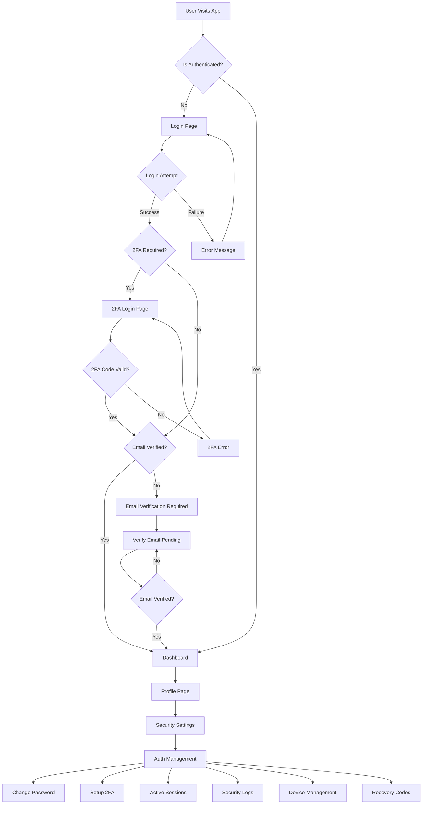
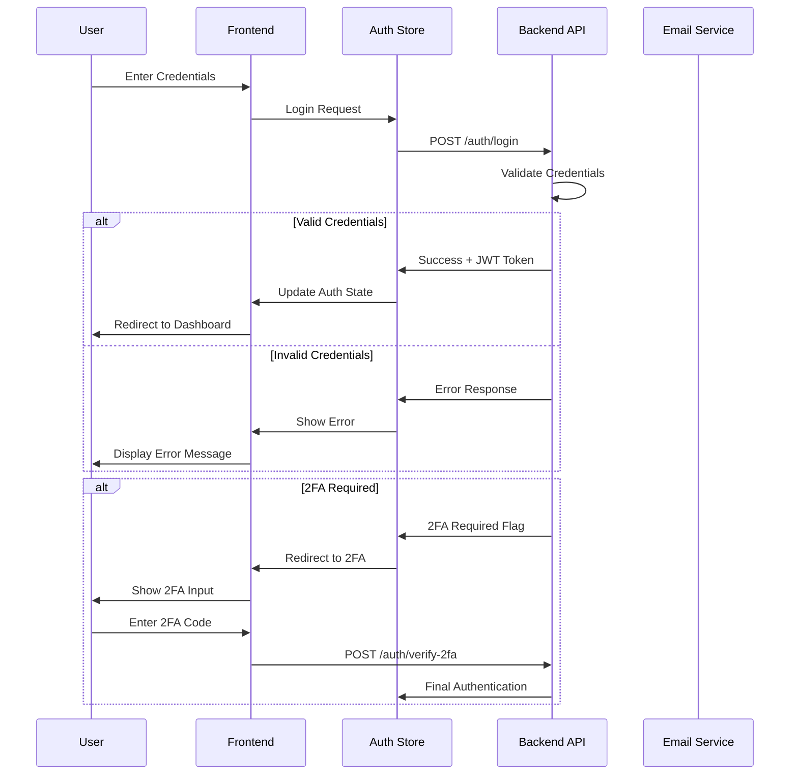
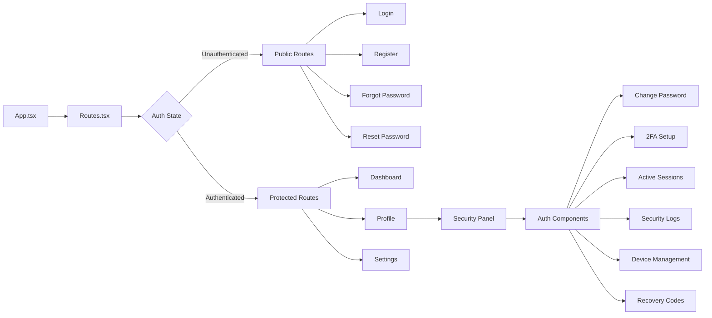
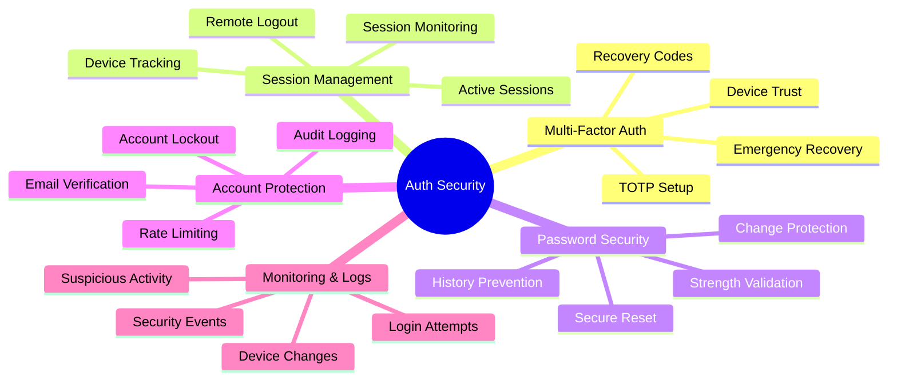

# CompliAI Authentication System - Flow Diagram

## 🔄 Complete Authentication Flow

## 🛡️ Security Flow Architecture

## 📱 Component Interaction Flow

## 🔐 Security Feature Map

---

*Complete flow diagrams showing how the CompliAI authentication system works from user interaction to security monitoring.*